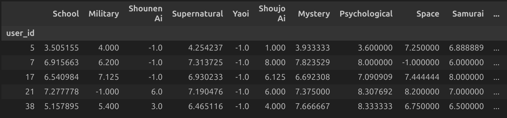
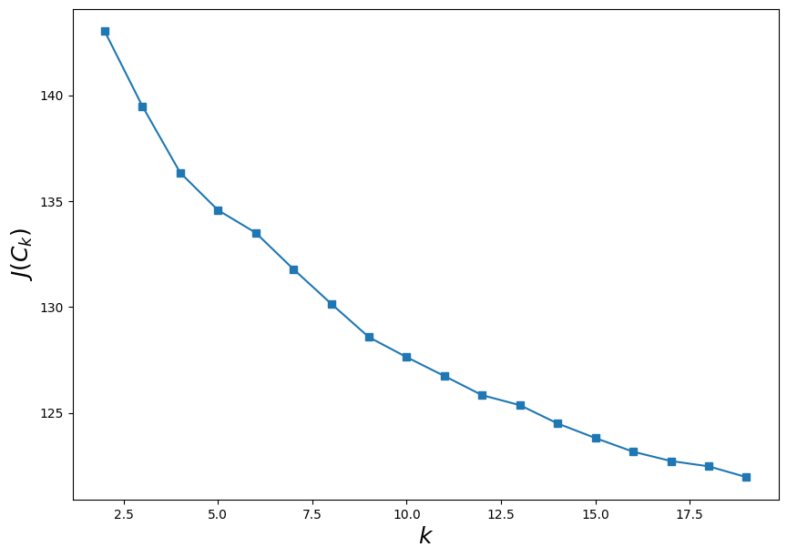
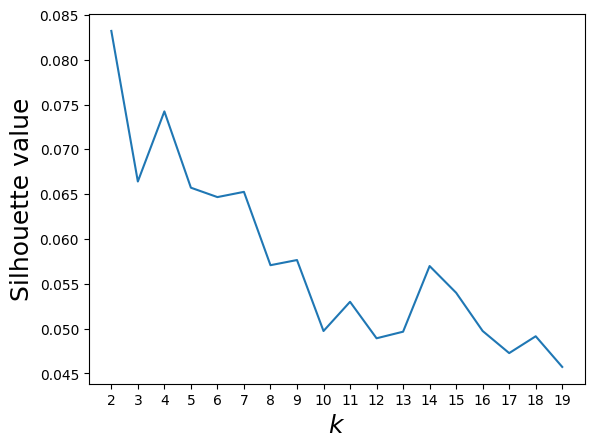
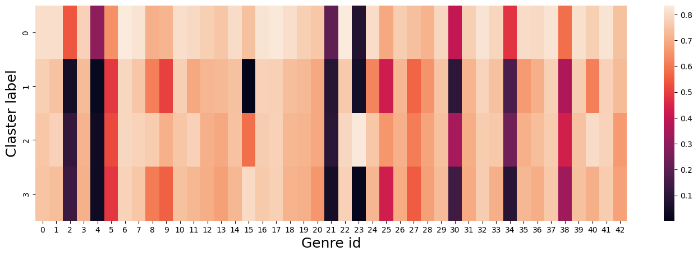

# Anime recommendation system 

This notebook is an implementation of a recommender system based on clustering anime user ratings

## Data preprocessing

### Removing emissions (Chauvenet criterion)

1) Anime with unknown ratings have been removed from the data.

2) The data were cleaned using the Chauvenet criterion:

$$ erfc(\frac{|P_i - mean(P)|}{S_p})  < \frac{1}{2n}$$

$ S_p - deviation $

In ratings table the criterion considered outliers to be those who watched too much anime; they don’t need a recommendation system, since they already understand the topic better than any algorithm.

in anime table the criterion considered anime with too high or too low ratings as outliers, and it also excluded the most popular anime

### Compiling a one-hot table with reviews by genre

After compiling the one-hot table, we have the following tables:
- Anime genres - in the anime rows, in the anime genre columns, and in the cells 0 or 1.
- Ratings - in the users rows, in the anime id and rating columns

You need to get another table, in which the rows will contain users, and the columns will contain anime genres. And in the cells, the average genre rating by this user.

The average genre rating is calculated as follows: all user reviews are taken. All of his reviews are grouped by genre and the average rating that he gives to anime with this genre is calculated. all NaNs are replaced with -1. 

## Clustering (KMeans)

For clustering, features (scores) were scaled using a [MinMaxScaler](https://scikit-learn.org/stable/modules/generated/sklearn.preprocessing.MinMaxScaler.html)

### Inertia coefficient

It is logical that we want the points to be located close to the centers of their clusters. But here's the problem: the minimum of such a functional will be achieved when there are as many clusters as points (i.e., each point is a cluster of one element). To solve this problem (choosing the number of clusters), the following heuristic is often used: choose the number of clusters starting from which the described functional $ J(C) $ decreases "not so fast"

$$ D(k) = \frac{|J(C_k) - J(C_{k+1})|}{|J(C_{k-1}) - J(C_k)|}  \rightarrow \min\limits_k $$

Where, in the case of KMeans $$ J(C) = \sum_{k=1}^K\sum_{i~\in~C_k} ||x_i - \mu_k|| \rightarrow \min\limits_C,$$ — the sum of the squares of the distances from points to the centroids of the clusters to which they belong

### Silhouette coefficient

First, the silhouette is determined separately for each object. Let $a$ be the average distance from a given object to objects from the same cluster, and $b$ be the average distance from a given object to objects from the nearest cluster (different from the one in which the object itself lies). Then the silhouette of a given object is called the value:
$$s = \frac{b - a}{\max(a, b)}.$$ 

The silhouette of a sample is the average value of the silhouette of objects in a given sample. Thus, the silhouette shows how much the average distance to objects in its cluster differs from the average distance to objects in other clusters.

### Fitting the best model

After analyzing the graphs, the value for the number of clusters was chosen to be k=4.

Heatmap of cluster centers:

## Recommendation system 

To recommend something to a user, you need his ratings for anime genres and viewing history, so as not to recommend watched anime.

Using user ratings we predict user membership in 1 of 4 clusters.

### Identifying the most relevant anime for each cluster

1) The most popular genres in the cluster are determined

2) A hyper parameter combo is set, which is responsible for the number of top genres in a particular anime

3) Anime in which the number of top genres is greater than the combo are selected from the data

### Prediction

Finally, to implement the recommendation, the anime already watched by the user is removed from the resulting list and the top 5 by rating are selected from them.

